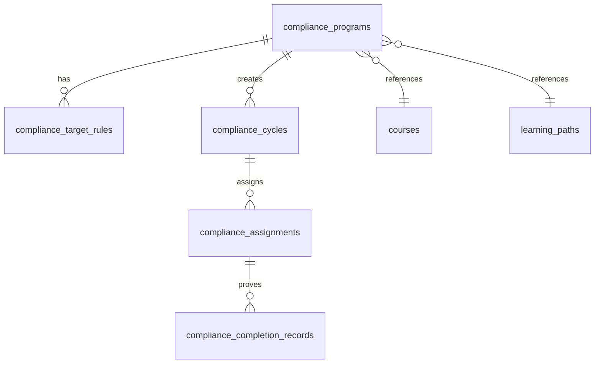

# Compliance Training Architecture

## Current Schema Audit

The production-facing Worker schema uses text IDs for the LMS tables created in `006_worker_compatible_schema.sql` and `010_learning_paths.sql`. The original UUID schema still exists in earlier migrations, but the active Worker routes read/write the text-ID tables:

- `profiles.id`: used by Worker as account/employee ID. Earlier schema declares UUID, but Worker-compatible routes compare text IDs from JWT/header sessions.
- `courses.id`: text in Worker-compatible schema, with `status`, `delivery_mode`, and `data jsonb`.
- `learning_paths.id`: text, with `status`, `completion_mode`, and `data jsonb`.
- Department: `profiles.department` in Worker routes; earlier `department_id` table exists but is not what current API uses.
- Job title: `profiles.position`.
- Active employees: `profiles.role = 'employee'` and `account_status in ('active','pending','locked')`, excluding soft-deleted notes.
- Enrollment completion: `enrollments.status = 'completed'` or `data.progressPercent >= 100`.
- Quiz pass evidence: `quiz_attempts.score_percent`, `passed`, `submitted_at`; current quiz POST still accepts learner-submitted score, so Compliance does not trust Employee sync input.
- Learning Path completion: `learning_path_assignments.status = 'completed'` and `progress_percent = 100`.
- Timestamp convention: `timestamptz` with `now()` and Worker `new Date().toISOString()`.
- Status convention: text fields with check constraints.
- Database helper: `worker/services/supabase.js` creates a Supabase client with service-role key and no persisted auth session.

`docs/learning-path-architecture.md` was requested in the handoff but does not exist in this repository.

## Reused Tables

Compliance references existing resources instead of duplicating content:

- `courses`
- `enrollments`
- `quiz_attempts`
- `learning_paths`
- `learning_path_assignments`
- `profiles`
- `notifications` as a future hook target

## New Tables

Migration `supabase/migrations/011_compliance_training.sql` adds:

- `compliance_programs`
- `compliance_target_rules`
- `compliance_cycles`
- `compliance_assignments`
- `compliance_completion_records`

Program and cycle resource references are polymorphic (`resource_type`, `resource_id`), so the Worker validates that the referenced Course or Learning Path exists and is published.

## Entity Relationships

## Recurrence Model

Programs define recurrence as `one_time`, `annual`, `semiannual`, or `custom_months`. Phase 3 creates cycles manually; no scheduler creates future cycles automatically. Each cycle snapshots resource reference, pass score, max attempts, and timing so later program edits do not rewrite old cycle history.

## Assignment Model

Target rules support `all_employees`, `department`, `job_title`, and `individual`. The Worker resolves rules against active employee profiles, previews matches, reports existing assignments, and inserts only missing `(cycle_id, employee_id)` rows. The unique constraint prevents duplicates.

## Completion Evidence

Completion is synchronized server-side:

- Course resource: enrollment completion is required. If a pass score is configured, quiz attempt evidence must meet the score.
- Learning Path resource: the linked learning path assignment must be completed at 100%.
- Manual completion: HR-only, requires reason and evidence, and writes a completion record.

`compliance_completion_records` are immutable evidence rows. They record assignment, cycle, employee, source, score/attempt when available, on-time status, and JSON evidence.

## Security Model

The intended model is Worker-only:

- Frontend calls only `/api/admin/compliance/*` and `/api/compliance/my*`.
- Worker uses Supabase service-role key server-side.
- HR endpoints call `requireHr()`.
- Employee endpoints call `requireAuth()` and filter by `employee_id = acct.accountId`.
- Employee endpoints never accept `employee_id`, `score`, `completed_at`, or `status` as trusted input.
- IDOR protection is enforced by assignment ownership filters.

Caveat: current middleware still supports legacy `X-Account-Id`/`X-Account-Role` headers as a backward-compatible fallback. This means the project is Worker-only but not JWT-only. Removing header fallback is a separate auth-hardening task because existing Phase 2 tests and routes still use it.

Migration `011` originally followed the Phase 2 Worker-only pattern and disabled RLS. Production verification showed anon REST can reach empty Compliance tables when the public anon key is used directly, so migration `012_compliance_training_rls.sql` enables RLS on all Compliance tables and intentionally creates no direct anon/authenticated policies. The Cloudflare Worker uses the service-role key and continues to access the tables server-side.

## Notification Hooks

Phase 3 stores hook names in row metadata and creates API points where Phase 6 can attach notifications:

- `compliance_assigned`
- `compliance_due_soon`
- `compliance_overdue`
- `compliance_completed`
- `compliance_failed`
- `compliance_exempted`

No email scheduler, retry engine, or notification preferences are implemented in Phase 3.

## Audit Hooks

Worker actions include clear hook points:

- `program_created`
- `program_published`
- `cycle_activated`
- `assignments_created`
- `assignment_exempted`
- `manual_completion`

No full audit-log table is added in Phase 3.

## Versioning Hooks

Cycles store `resource_revision_reference` from the program/resource timing available at creation. Completion records also store the resource type/id used at the time of completion. Full Course Versioning and automatic retraining on resource change are left for Phase 8.

## Migration Plan

1. Apply `supabase/migrations/011_compliance_training.sql`.
2. Apply `supabase/migrations/012_compliance_training_rls.sql`.
3. Deploy Worker/API/UI.
4. Create a `[TEST]` program through the HR API/UI using a published Course or Learning Path.
5. Target only `employee.test@kisvn.vn` / its profile ID.
6. Create a cycle with a future deadline, activate it, and assign.
7. Verify Employee visibility, ownership, sync behavior, duplicate prevention, direct REST denial, and manual HR actions.

## Rollback Note

Rollback is manual and must not run while compliance evidence is needed. Drop order is completion records, assignments, cycles, target rules, programs. The SQL rollback note is embedded in the migration.

## Acceptance Criteria

- Program, target, cycle, assignment, and completion evidence persist in Supabase.
- Duplicate assignments are blocked by database constraint and API flow.
- Employee cannot read another employee assignment.
- Employee cannot self-report score, completion date, or completion status.
- HR manual completion requires reason and evidence.
- Overdue status is computed in the Worker, not only in the frontend.
- Annual/semiannual cycles remain independent; old completion records do not complete new cycles.
